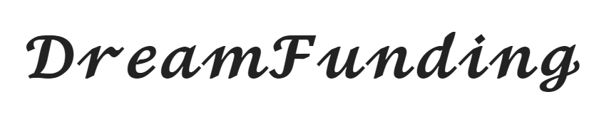
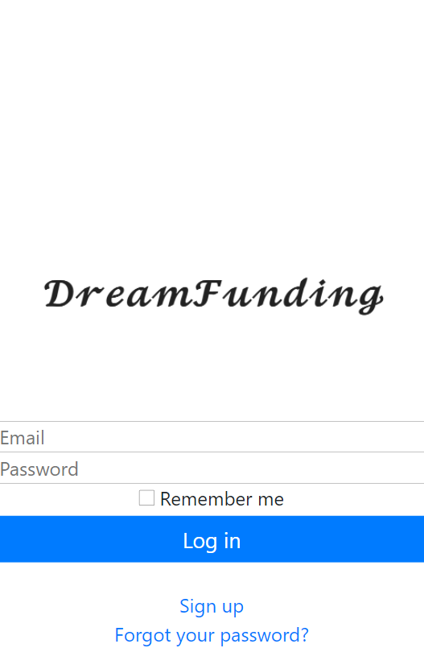

[![Contributors][contributors-shield]][contributors-url]
[![Forks][forks-shield]][forks-url]
[![Stargazers][stars-shield]][stars-url]
[![Issues][issues-shield]][issues-url]

<!-- PROJECT LOGO -->
<br />
<p align="center">
  <a href="https://github.com/e71az/dream-funding" style="text-decoration: none;">
    
  </a>

  <h2 align="center">Dream Funding Project</h2>

  <h3 align="center">Rails Project --> dream-funding<h3>
  <p align="center">
    <a href="https://github.com/e71az/dream-funding"><strong>Explore the docs »</strong></a>
    <br />
    <br />
    -
    <a href="https://github.com/e71az/dream-funding/issues">Report a Bug</a>
    -
    <a href="https://github.com/e71az/dream-funding/issues">Request a Feature</a>
    -
  </p>
</p>

<!-- TABLE OF CONTENTS -->
## Table of Contents

* [About the Project](#about-the-project)
  * [Mobile View](#mobile-view)
  * [Built With](#built-with)
  * [Rules](#rules)
  * [Usage](#usage)
  * [Automated Test](#autoamted-test)
* [Contributors](#contributors)
* [Contributing](#contributing)
* [Acknowledgements](#acknowledgements)
* [License](#license)

<!-- ABOUT THE PROJECT -->
## About The Project

This is the **dream-funding** Capstone project where users are able to donate to selfish causes from other users. The idea is based on GoFundMe but with a little twist. I was required to create a grouping system to showcase my Rails skills in this final project.

### Mobile view



## Demo Link

[Live Demo Link](https://enigmatic-mesa-94696.herokuapp.com/).

## Video Explanation

[Demo Video](https://www.loom.com/share/5d88bff6fbe043b4b9742282c184c936).

## Design Idea

[Gregoire Vella](https://www.behance.net/gregoirevella).

## Restrictions

**Logged In**
* Only registered and logged in users can create Dreams. They are refered to as **Authors**.

**Donors**
* Only registered users can donate to Dreams. They are refered to as **Donors**

## Getting Started

To get a local copy up and running follow these simple example steps:

- Clone this repository into your local machine.
- Run:

```bash
  $ gem install bundler
```

- Run:

```bash
  $ bundle install
```

- Run

```bash
  $ rails db:migrate
```

- Run the rails server:

```bash
  $ rails server
```

- Enter in your web browser address bar:

    localhost:3000

- Create an account and navigate the webpage!

- Play with the app!

**Automated Test**
* Run the command and see the output
```
$ rspec
```

### Built With
This project was built using these technologies and main gems:
* Ruby on Rails
* Rspec
* Rubocop
* Capybara
* VsCode
* Devise
* PostgreSQL
* Goldiloader
* Schema to scaffold
* Font awesome rails
* Rails controller testing
* Factory bot rails
* Faker

## Potential future features
- To take a cut from the donations and assign that money to a non-profit cause voted by the Dream Funding users.

## Contributors

👤 **Elias Castañeda**

- Github: [@e71az](https://github.com/e71az)
- Linkedin: [@e71az](https://www.linkedin.com/in/eliasecasta/)

## :handshake: Contributing
Contributions, issues and feature requests are welcome!
Feel free to check the [issues page](https://github.com/e71az/dream-funding/issues)

## Show your support
Give a :star: if you like this project!

<!-- MARKDOWN LINKS & IMAGES -->
<!-- https://www.markdownguide.org/basic-syntax/#reference-style-links -->
[contributors-shield]: https://img.shields.io/github/contributors/e71az/dream-funding.svg?style=flat-square
[contributors-url]: https://github.com/e71az/dream-funding/graphs/contributors
[forks-shield]: https://img.shields.io/github/forks/e71az/dream-funding
[forks-url]: https://github.com/e71az/dream-funding/network/members
[stars-shield]: https://img.shields.io/github/stars/e71az/dream-funding
[stars-url]: https://github.com/e71az/dream-funding/stargazers
[issues-shield]: https://img.shields.io/github/issues/e71az/dream-funding.svg?style=flat-square
[issues-url]: https://github.com/e71az/dream-funding/issues

## 📝 License

This project is [MIT](https://opensource.org/licenses/MIT) licensed.
